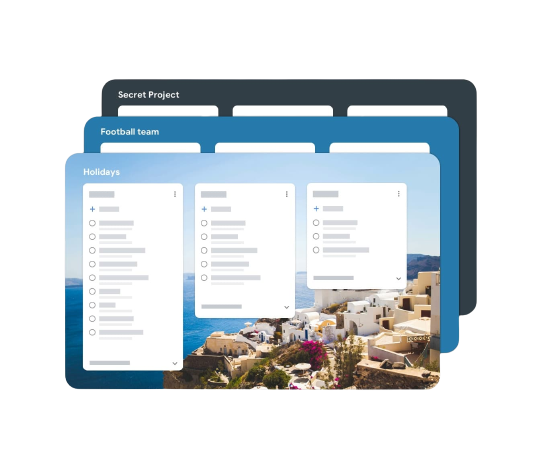

# Nrello — Trello Clone

A full-stack Trello-style project management app built with Nuxt 3. Create boards, organise work into lists, and manage cards with drag-and-drop. Premium plans unlock unlimited boards via Stripe.



---

## Tech Stack

| Layer | Technology |
|---|---|
| Framework | [Nuxt 3](https://nuxt.com) (Vue 3, Nitro, Vite) |
| UI | [@nuxt/ui](https://ui.nuxt.com) v2 · Tailwind CSS v3 |
| Auth | [@sidebase/nuxt-auth](https://sidebase.io/nuxt-auth) · NextAuth.js (JWT + Credentials) |
| Database | MongoDB Atlas via [Mongoose](https://mongoosejs.com) |
| Payments | [Stripe](https://stripe.com) subscriptions + webhook |
| Rich text | [Vue Quill](https://vueup.github.io/vue-quill) |
| Drag & drop | [vuedraggable](https://github.com/SortableJS/vue.draggable.next) |
| Images | [Pixabay API](https://pixabay.com/api/docs) · [@nuxt/image](https://image.nuxt.com) |
| Validation | [Zod](https://zod.dev) |

---

## Features

- **Boards** — create and delete boards with custom cover images from Pixabay
- **Lists** — add and reorder lists within a board via drag-and-drop
- **Cards** — create cards with rich text descriptions (Quill editor), drag between lists
- **Authentication** — sign up / sign in with email & password, JWT sessions
- **Subscription gating** — free plan is limited to 1 board; upgrade via Stripe Checkout
- **Billing portal** — manage or cancel subscriptions via Stripe Customer Portal
- **Dark mode** — system-preference aware theme switcher

---

## Project Structure

```
├── components/         # Vue components (Board, List, Card, Forms, Wrappers)
├── composables/        # useBoard, useList, useCard, useSubscription, useSignin
├── pages/              # File-based routing (/, /[boardId], /auth/signin, /auth/signup)
├── schemas/            # Zod validation schemas shared by client and server
├── scripts/            # Utility scripts (seed.mjs)
├── server/
│   ├── api/            # REST endpoints (boards, lists, cards, auth, users, webhooks)
│   ├── middleware/     # Auth guard for protected routes
│   ├── models/         # Mongoose models (User, Board, List, Card)
│   └── plugins/        # Mongoose connection plugin
└── utils/              # Hash helper, Stripe client, Zod validator helper
```

---

## Getting Started

### Prerequisites

- Node.js 18+
- pnpm (`npm i -g pnpm`)
- MongoDB Atlas cluster (or local MongoDB)
- Stripe account (test mode is fine)
- Pixabay API key (free)

### 1. Clone and install

```bash
git clone https://github.com/jayan92/nuxt-trello.git
cd nuxt-trello
pnpm install
```

### 2. Configure environment variables

Copy the example below into a `.env` file at the project root and fill in your values:

```env
# Auth
AUTH_ORIGIN=http://localhost:3000
AUTH_SECRET=your_random_secret_min_32_chars

# MongoDB
MONGODB_URI=mongodb+srv://<user>:<pass>@cluster.mongodb.net/nrello?retryWrites=true&w=majority

# Stripe
STRIPE_PUBLIC_KEY=pk_test_...
STRIPE_SECRET_KEY=sk_test_...
STRIPE_WEBHOOK_SECRET=whsec_...
STRIPE_PRICE_ID=price_...

# Pixabay
PIXABAY_API_KEY=your_pixabay_key
```

Generate a strong `AUTH_SECRET`:
```bash
node -e "console.log(require('crypto').randomBytes(32).toString('hex'))"
```

### 3. Seed demo data (optional)

Creates a demo user with pre-populated boards, lists, and cards:

```bash
pnpm seed
```

Demo credentials:
```
Email:    demo@nrello.com
Password: Demo1234!
```

### 4. Start the development server

```bash
pnpm dev
```

Open [http://localhost:3000](http://localhost:3000).

---

## Stripe Setup

1. Create a product and a recurring price in the [Stripe Dashboard](https://dashboard.stripe.com/test/products).
2. Copy the **Price ID** (`price_...`) into `STRIPE_PRICE_ID`.
3. For local webhook testing install the [Stripe CLI](https://stripe.com/docs/stripe-cli) and run:

```bash
stripe listen --forward-to localhost:3000/api/webhooks/stripe
```

Copy the webhook signing secret (`whsec_...`) it prints into `STRIPE_WEBHOOK_SECRET`.

---

## Available Scripts

| Command | Description |
|---|---|
| `pnpm dev` | Start development server |
| `pnpm build` | Build for production |
| `pnpm preview` | Preview production build locally |
| `pnpm seed` | Seed demo user and sample data into MongoDB |

---

## API Routes

| Method | Route | Description |
|---|---|---|
| GET | `/api/boards` | List all boards for current user |
| POST | `/api/boards` | Create a board |
| GET | `/api/boards/:id` | Get a board with its lists |
| PUT | `/api/boards/:id` | Update a board |
| DELETE | `/api/boards/:id` | Delete a board |
| POST | `/api/lists` | Create a list |
| PUT | `/api/lists/:id` | Update a list (name, card order) |
| DELETE | `/api/lists/:id` | Delete a list |
| GET | `/api/lists/:id/cards` | Get cards for a list |
| POST | `/api/lists/:id/cards` | Create a card |
| PUT | `/api/lists/:id/cards/:cardId` | Update a card |
| DELETE | `/api/lists/:id/cards/:cardId` | Delete a card |
| POST | `/api/users/subscribe` | Start Stripe Checkout session |
| GET | `/api/users/access-portal` | Open Stripe billing portal |
| POST | `/api/webhooks/stripe` | Handle Stripe subscription events |
